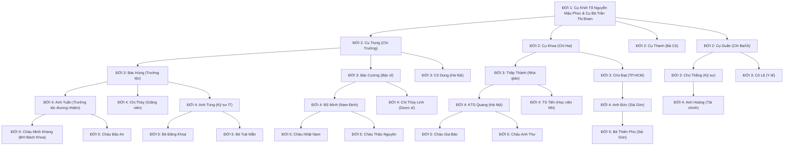

# PHẢ KÝ & THẾ THỨ DÒNG HỌ NGUYỄN MẬU (NGÀNH 4)
**Địa chỉ Cội Nguồn**: Thôn Thượng Đền, Thị trấn Cổ Lễ, Huyện Trực Ninh, Tỉnh Nam Định

---

## I. LỜI NÓI ĐẦU (PHẢ KÝ CỘI NGUỒN)

> *"Cây có gốc mới nở cành xanh ngọn,*  
> *Nước có nguồn mới bể rộng sông sâu.*  
> *Người ta nguồn gốc từ đâu,*  
> *Gốc là Tiên Tổ, rồi sau có mình."*

Vùng đất **Cổ Lễ** (huyện Trực Ninh, tỉnh Nam Định) là nơi địa linh nhân kiệt nằm bên dòng sông Ninh Cơ, gắn liền với di tích lịch sử - văn hóa quốc gia đặc biệt **Chùa Cổ Lễ (Thần Quang Tự)** do Đức Thánh Tổ Nguyễn Minh Không sáng lập từ thời Lý. 

Tại **Thôn Thượng Đền**, dòng họ **Nguyễn Mậu** là một trong những cự tộc danh gia định cư, khai hoang lập ấp, cùng nhân dân địa phương đắp đê, trị thủy, giữ gìn phong tục và mở mang nghiệp học.

**Ngành 4** dòng họ Nguyễn Mậu được kế thừa và phát triển từ **Cụ Khởi Tổ Nguyễn Mậu Phúc** (Tự: *Thuần Hậu*, Hiệu: *Phúc Điền Cư Sĩ*). Trải qua bao biến thiên lịch sử của đất nước, con cháu Ngành 4 dòng họ Nguyễn Mậu luôn giữ vững truyền thống: **Cần cù trong lao động, hiếu nghĩa trong gia đình, tôn sư trọng đạo, hết lòng phụng sự quê hương đất nước**.

Cuốn Gia phả này được số hóa trên nền tảng **GiaPha-OS** nhằm mục đích:
1. Ghi nhớ công đức sâu dày của Tiên Tổ và các thế hệ tiền nhân.
2. Lưu giữ chính xác thế thứ, cội nguồn, ngày kỵ nhật (ngày giỗ Âm lịch), nơi an táng của các bậc tiền bối.
3. Tạo cầu nối gắn kết tình thân giữa các chi phái, con cháu nội ngoại ở khắp mọi miền Tổ quốc và hải ngoại.
4. Giáo dục thế hệ trẻ lòng tự hào dòng tộc, phát huy truyền thống hiếu học và gia phong tốt đẹp.

---

## II. QUY MÔ & TỔ CHỨC DÒNG HỌ (NGÀNH 4)

- **Từ đường Ngành 4**: Đặt tại Thôn Thượng Đền, Thị trấn Cổ Lễ, Huyện Trực Ninh, Tỉnh Nam Định.
- **Khu Lăng Mộ Dòng Họ**: Nghĩa trang Thượng Đền và Nghĩa trang Đồng Thượng, TT. Cổ Lễ.
- **Ngày Giỗ Tổ Ngành 4 (Kỵ Nhật Chính)**: **Rằm tháng 8 Âm lịch (15/08 Âm lịch)** hàng năm (Ngày giỗ Cụ Khởi Tổ Nguyễn Mậu Phúc).
- **Ngày Tảo Mộ Toàn Tộc**: Tiết Thanh Minh hàng năm.
- **Tổng số thành viên số hóa hiện tại**: 48 người thuộc **5 thế hệ** (từ Cụ Tổ đến các cháu đời 5).

---

## III. THẾ THỨ PHẢ HỆ CHI TIẾT (5 ĐỜI)

---

### 1. THẾ HỆ THỨ NHẤT (ĐỜI 1 - CỤ TỔ NGÀNH 4)
1. **Cụ Ông**: **Nguyễn Mậu Phúc** (1895 – 1968)
   - Tự: *Thuần Hậu*, Hiệu: *Phúc Điền Cư Sĩ*.
   - Kỵ nhật (Ngày giỗ): **15 tháng 8 Âm lịch** (Rằm tháng Tám).
   - Tiểu sử: Cụ Khởi Tổ Ngành 4 dòng họ Nguyễn Mậu tại Thôn Thượng Đền, Cổ Lễ. Sinh thời đức độ, nho nhã, tinh thông y thuật và phong thủy, có công tạo dựng cơ nghiệp và quy hoạch từ đường ngành 4. Phần mộ an táng tại Nghĩa trang Thượng Đền.
2. **Cụ Bà (Chính Thất)**: **Trần Thị Đoan** (1898 – 1972)
   - Hiệu: *Từ Tâm Nhu Thuận*.
   - Kỵ nhật (Ngày giỗ): **22 tháng 10 Âm lịch**.
   - Tiểu sử: Người làng Chùa Cổ Lễ, hiền thục nết na, tần tảo nuôi dạy 4 người con (3 trai, 1 gái) thành đạt. Mộ an táng cạnh Cụ Ông tại Nghĩa trang Thượng Đền.

---

### 2. THẾ HỆ THỨ HAI (ĐỜI 2 - CÁC CHI TRƯỞNG & THỨ)
1. **Cụ Nguyễn Mậu Trọng** (1920 – 1995) – *Trưởng nam Ngành 4 (Chi Trưởng)*.
   - Tự: *Minh Chính*. Kỵ nhật: **12 tháng 3 Âm lịch**.
   - Tiểu sử: Từng tham gia kháng chiến chống Pháp, phụ trách công tác thủ công nghiệp tại HTX Cổ Lễ. Người gìn giữ cuốn gia phả gốc bằng chữ Hán Nôm và khởi xướng trùng tu từ đường.
   - Vợ: **Cụ Lê Thị Mùi** (1923 – 2002), kỵ nhật **06 tháng 6 Âm lịch**.
2. **Cụ Nguyễn Mậu Khoa** (1925 – 2005) – *Nhị nam Ngành 4 (Chi Hai)*.
   - Tự: *Văn Bác*. Kỵ nhật: **18 tháng 11 Âm lịch**.
   - Tiểu sử: Nhà giáo dạy chữ Nho và chữ Quốc ngữ nhiều năm tại huyện Trực Ninh. Học trò khắp vùng kính trọng.
   - Vợ: **Cụ Phạm Thị Nhàn** (1928 – 2010), kỵ nhật **09 tháng 9 Âm lịch**.
3. **Cụ Nguyễn Thị Thanh** (1929 – 2015) – *Trưởng nữ Ngành 4 (Bà Cô)*.
   - Kỵ nhật: **04 tháng 4 Âm lịch**. Lấy chồng về họ Vũ làng Cổ Lễ.
   - Chồng: **Cụ Vũ Đình Cường** (1926 – 1998), kỵ nhật **20 tháng Giêng Âm lịch**.
4. **Cụ Nguyễn Mậu Duẩn** (1934 – 2018) – *Tam nam Ngành 4 (Chi Ba)*.
   - Tự: *Hữu Chí*. Kỵ nhật: **14 tháng 7 Âm lịch**.
   - Tiểu sử: Cựu chiến binh, nguyên cán bộ ngành Giao thông Vận tải Nam Hà. Sau về sinh sống tại TT. Cổ Lễ, tham gia ban khánh tiết Đền Thượng.
   - Vợ: **Cụ Hoàng Thị Thược** (1938 – 2021), kỵ nhật **28 tháng Chạp Âm lịch**.

---

### 3. THẾ HỆ THỨ BA (ĐỜI 3 - BỐ MẸ / CÔ CHÚ)
- **Nhánh Cụ Trọng**:
  - **Nguyễn Mậu Hùng** (1948 – 2020), Kỵ nhật: **08 tháng 5 Âm lịch**. Kỹ sư cơ khí, nguyên trưởng tộc trông coi nhà thờ họ. Vợ: **Đỗ Thị Mai** (Sinh 1952, Giáo viên nghỉ hưu, hiện trông coi từ đường Thượng Đền).
  - **Nguyễn Mậu Cường** (Sinh 1953), Bác sĩ Quân y nghỉ hưu tại TP. Nam Định. Vợ: **Trịnh Thị Lan** (Sinh 1956).
  - **Nguyễn Thị Kim Dung** (Sinh 1958), Cán bộ Ngân hàng nghỉ hưu tại Hà Nội. Chồng: **Bùi Văn Tuấn** (Sinh 1955).
- **Nhánh Cụ Khoa**:
  - **Nguyễn Mậu Thành** (Sinh 1954), Nhà giáo Ưu tú, nguyên Hiệu trưởng trường THPT tại Trực Ninh. Vợ: **Nguyễn Thị Hạnh** (Sinh 1957, Giáo viên Văn).
  - **Nguyễn Mậu Đạt** (Sinh 1960), Doanh nhân ngành dệt may tại Quận 7, TP.HCM. Vợ: **Vũ Thị Ngọc** (Sinh 1963).
- **Nhánh Cụ Duẩn**:
  - **Nguyễn Mậu Thắng** (Sinh 1964), Kỹ sư Xây dựng Cầu đường tại Hà Nội. Vợ: **Trần Thu Hương** (Sinh 1968).
  - **Nguyễn Thị Lệ** (Sinh 1969), Cán bộ Y tế huyện Trực Ninh. Chồng: **Đinh Văn Hải** (Sinh 1966).

---

### 4. THẾ HỆ THỨ BỐN (ĐỜI 4 - ĐƯƠNG ĐẠI)
- **Nguyễn Mậu Tuấn** (Sinh 1976) – Trưởng tộc đời 4, Giám đốc doanh nghiệp tại Hà Nội & Nam Định. Vợ: **Phạm Thị Hồng Hạnh** (Sinh 1979, Thạc sĩ Kinh tế).
- **Nguyễn Thị Bích Thủy** (Sinh 1981) – Giảng viên Đại học Thương Mại Hà Nội. Chồng: **Lê Hoàng Long** (Sinh 1980, Tiến sĩ Luật).
- **Nguyễn Mậu Tùng** (Sinh 1986) – Kỹ sư Công nghệ thông tin, quản trị số hóa gia phả. Vợ: **Ngô Phương Linh** (Sinh 1989, Trưởng phòng Nhân sự).
- **Nguyễn Mậu Minh** (Sinh 1982) – Bác sĩ Ngoại khoa BV Đa khoa Nam Định. Vợ: **Hoàng Yến Nhi** (Sinh 1985, Bác sĩ Nhi).
- **Nguyễn Thị Thùy Linh** (Sinh 1988) – Dược sĩ tại TP. Nam Định.
- **Nguyễn Mậu Quang** (Sinh 1983) – Thạc sĩ Kiến trúc sư tại Hà Nội. Vợ: **Đặng Thu Trang** (Sinh 1986, KTS Nội thất).
- **Nguyễn Mậu Tiến** (Sinh 1987) – Tiến sĩ Nông nghiệp, Giảng viên Học viện Nông nghiệp Việt Nam.
- **Nguyễn Mậu Đức** (Sinh 1990) – Giám đốc Kinh doanh tại TP. Hồ Chí Minh. Vợ: **Trương Kiều Oanh** (Sinh 1993).
- **Nguyễn Mậu Hoàng** (Sinh 1994) – Chuyên viên Tài chính tại Hà Nội.

---

### 5. THẾ HỆ THỨ NĂM (ĐỜI 5 - HẬU DUỆ MĂNG NON)
- **Nguyễn Mậu Minh Khang** (Sinh 2004) – Sinh viên Khoa KHMT, Đại học Bách Khoa Hà Nội (Giải Nhì HSG Quốc gia Tin học).
- **Nguyễn Mậu Bảo An** (Sinh 2009) – Học sinh THPT Chuyên Hà Nội - Amsterdam.
- **Nguyễn Mậu Nhật Nam** (Sinh 2012) – Học sinh THCS Lê Hồng Phong, Nam Định.
- **Nguyễn Mậu Gia Bảo** (Sinh 2014) – Học sinh Tiểu học tại Hà Nội.
- **Nguyễn Thảo Nguyên** (Sinh 2015) – Học sinh Tiểu học tại TP. Nam Định.
- **Nguyễn Mậu Đăng Khoa** (Sinh 2016) – Học sinh Tiểu học tại Hà Nội.
- **Nguyễn Ngọc Anh Thư** (Sinh 2018) – Hà Nội.
- **Nguyễn Tuệ Mẫn** (Sinh 2020) – Hà Nội.
- **Nguyễn Mậu Thiên Phú** (Sinh 2021) – TP. Hồ Chí Minh.

---

## IV. BẢNG TRA CỨU KỴ NHẬT (NGÀY GIỖ ÂM LỊCH) TRONG NĂM

| STT | Họ và Tên | Thế hệ | Danh xưng dòng tộc | Ngày Giỗ (Âm Lịch) | Nơi An Táng |
|:---:|:---|:---:|:---|:---:|:---|
| 1 | **Vũ Đình Cường** | Đời 2 | Cụ Rể | **20 tháng Giêng** | Nghĩa trang TT. Cổ Lễ |
| 2 | **Nguyễn Mậu Trọng** | Đời 2 | Cụ Trưởng Chi 1 | **12 tháng 3** | Nghĩa trang Thượng Đền |
| 3 | **Nguyễn Thị Thanh** | Đời 2 | Cụ Bà Cô Trưởng | **04 tháng 4** | Nghĩa trang Cổ Lễ |
| 4 | **Nguyễn Mậu Hùng** | Đời 3 | Bác Trưởng Tộc đời 3 | **08 tháng 5** | Nghĩa trang Thượng Đền |
| 5 | **Lê Thị Mùi** | Đời 2 | Cụ Bà Dâu Trưởng | **06 tháng 6** | Nghĩa trang Thượng Đền |
| 6 | **Nguyễn Mậu Duẩn** | Đời 2 | Cụ Trưởng Chi 3 | **14 tháng 7** | Nghĩa trang Thượng Đền |
| 7 | **Nguyễn Mậu Phúc** | **Đời 1** | **CỤ KHỞI TỔ NGÀNH 4** | **15 tháng 8 (Rằm)** | **Khu Lăng Mộ Thượng Đền** |
| 8 | **Phạm Thị Nhàn** | Đời 2 | Cụ Bà Dâu Chi 2 | **09 tháng 9** | Nghĩa trang Đồng Thượng |
| 9 | **Trần Thị Đoan** | **Đời 1** | **CỤ BÀ CHÍNH THẤT** | **22 tháng 10** | **Khu Lăng Mộ Thượng Đền** |
| 10 | **Nguyễn Mậu Khoa** | Đời 2 | Cụ Trưởng Chi 2 | **18 tháng 11** | Nghĩa trang Đồng Thượng |
| 11 | **Hoàng Thị Thược** | Đời 2 | Cụ Bà Dâu Chi 3 | **28 tháng Chạp** | Nghĩa trang Thượng Đền |

---

## V. TỘC ƯỚC & TRUYỀN THỐNG DÒNG TỘC

1. **Uống nước nhớ nguồn**: Hàng năm vào ngày Rằm tháng Tám (Giỗ Cụ Tổ) và Tiết Thanh Minh (Tảo Mộ), con cháu các chi dù ở gần hay xa đều hướng về từ đường Thượng Đền, dâng hương tưởng nhớ công đức tổ tiên.
2. **Khuyến học - Khuyến tài**: Duy trì Quỹ Khuyến học họ Nguyễn Mậu Ngành 4. Khen thưởng và biểu dương các cháu đạt giải học sinh giỏi, đỗ đạt cử nhân, thạc sĩ, tiến sĩ vào dịp đầu năm mới.
3. **Đoàn kết - Tương trợ**: Giữ gìn hòa khí, lá lành đùm lá rách, tương trợ nhau trong cuộc sống, phát huy danh dự người họ Nguyễn Mậu quê hương Cổ Lễ - Trực Ninh - Nam Định.
