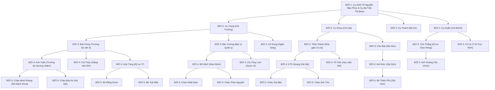

# GIA PHẢ DÒNG HỌ NGUYỄN MẬU (NGÀNH 4)
**Địa chỉ Cội Nguồn**: Thôn Thượng Đền, Thị trấn Cổ Lễ, Huyện Trực Ninh, Tỉnh Nam Định  
**Hệ thống Triển khai**: Nền tảng Quản lý Gia phả Mã nguồn mở **GiaPha-OS** (`https://github.com/homielab/giapha-os`)  
**Thời gian biên soạn & số hóa**: Năm Bính Ngọ (2026)

---

# MỤC LỤC

1. [Phần I: Phả Ký & Cội Nguồn Dòng Họ](#phần-i-phả-ký--cội-nguồn-dòng-họ)
2. [Phần II: Tộc Ước, Quy Chế & Nơi Thờ Tự](#phần-ii-tộc-ước-quy-chế--nơi-thờ-tự)
3. [Phần III: Sơ Đồ Phả Hệ Tổng Quan (5 Thế Hệ)](#phần-iii-sơ-đồ-phả-hệ-tổng-quan-5-thế-hệ)
4. [Phần IV: Hồ Sơ Phả Hệ Chi Tiết Từng Thế Hệ (Đời 1 đến Đời 5)](#phần-iv-hồ-sơ-phả-hệ-chi-tiết-từng-thế-hệ-đời-1-đến-đời-5)
   - [Thế Hệ Thứ Nhất (Đời 1 - Cụ Khởi Tổ Ngành 4)](#1-thế-hệ-thứ-nhất-đời-1---cụ-khởi-tổ-ngành-4)
   - [Thế Hệ Thứ Hai (Đời 2 - Các Chi Trưởng & Thứ)](#2-thế-hệ-thứ-hai-đời-2---các-chi-trưởng--thứ)
   - [Thế Hệ Thứ Ba (Đời 3 - Bố Mẹ / Cô Chú)](#3-thế-hệ-thứ-ba-đời-3---bố-mẹ--cô-chú)
   - [Thế Hệ Thứ Bốn (Đời 4 - Thế Hệ Đương Đại)](#4-thế-hệ-thứ-bốn-đời-4---thế-hệ-đương-đại)
   - [Thế Hệ Thứ Năm (Đời 5 - Hậu Duệ Măng Non)](#5-thế-hệ-thứ-năm-đời-5---hậu-duệ-măng-non)
5. [Phần V: Bảng Tra Cứu Kỵ Nhật (Ngày Giỗ Âm Lịch) & Sự Kiện Tế Tự](#phần-v-bảng-tra-cứu-kỵ-nhật-ngày-giỗ-âm-lịch--sự-kiện-tế-tự)
6. [Phần VI: Nghiên Cứu Kiến Trúc Mã Nguồn Mở GiaPha-OS](#phần-vi-nghiên-cứu-kiến-trúc-mã-nguồn-mở-giapha-os)
7. [Phần VII: Hướng Dẫn Cài Đặt, Triển Khai & Vận Hành Hệ Thống (A - Z)](#phần-vii-hướng-dẫn-cài-đặt-triển-khai--vận-hành-hệ-thống-a---z)
8. [Phần VIII: Danh Mục Tệp Tin & Dữ Liệu Kèm Theo Trong Dự Án](#phần-viii-danh-mục-tệp-tin--dữ-liệu-kèm-theo-trong-dự-án)

---

# PHẦN I: PHẢ KÝ & CỘI NGUỒN DÒNG HỌ

> *"Cây có gốc mới nở cành xanh ngọn,*  
> *Nước có nguồn mới bể rộng sông sâu.*  
> *Người ta nguồn gốc từ đâu,*  
> *Gốc là Tiên Tổ, rồi sau có mình."*

Vùng đất **Cổ Lễ** (nay là thị trấn Cổ Lễ, huyện Trực Ninh, tỉnh Nam Định) là vùng đất địa linh nhân kiệt nằm bên dòng sông Ninh Cơ phì nhiêu, gắn liền với di tích lịch sử - văn hóa quốc gia đặc biệt **Chùa Cổ Lễ (Thần Quang Tự)** do Đức Thánh Tổ Nguyễn Minh Không sáng lập từ thời nhà Lý.

Tại **Thôn Thượng Đền**, dòng họ **Nguyễn Mậu** là một trong những cự tộc danh gia định cư lâu đời, có công cùng nhân dân địa phương khai hoang mở đất, lập làng dựng ấp, đắp đê ngăn lũ, giữ gìn phong tục và mở mang nghiệp học.

**Ngành 4** dòng họ Nguyễn Mậu được khởi lập và phát triển vững mạnh từ **Cụ Khởi Tổ Nguyễn Mậu Phúc** (Tự: *Thuần Hậu*, Hiệu: *Phúc Điền Cư Sĩ*) cùng Cụ Bà Chính Thất **Trần Thị Đoan** (Hiệu: *Từ Tâm Nhu Thuận*). 

Trải qua nhiều thế hệ nối tiếp, con cháu Ngành 4 dòng họ Nguyễn Mậu luôn kế thừa và phát huy truyền thống tốt đẹp:
- **Cần cù, sáng tạo** trong lao động sản xuất và kinh doanh.
- **Tôn sư trọng đạo, hiếu học, đỗ đạt**, đóng góp nhiều trí thức, bác sĩ, kỹ sư, nhà giáo, cử nhân, thạc sĩ, tiến sĩ cho xã hội.
- **Hiếu thảo, hòa thuận**, trên kính dưới nhường, giữ trọn đạo lý làm người.
- **Yêu nước, kiên trung**, tích cực tham gia các cuộc kháng chiến bảo vệ Tổ quốc và công cuộc xây dựng đất nước.

Cuốn Gia phả này được biên soạn và số hóa trên nền tảng công nghệ hiện đại **GiaPha-OS** nhằm mục đích lưu truyền vạn đại muôn đời con cháu mai sau, giúp các thế hệ dù đi muôn phương vẫn luôn nhớ về cội nguồn, tiên tổ.

---

# PHẦN II: TỘC ƯỚC, QUY CHẾ & NƠI THỜ TỰ

### 1. Nơi Thờ Tự & Khu Lăng Mộ
- **Từ Đường Họ Nguyễn Mậu (Ngành 4)**: Đặt tại Thôn Thượng Đền, Thị trấn Cổ Lễ, Huyện Trực Ninh, Tỉnh Nam Định. Đây là nơi hội tụ linh khí dòng tộc, nơi phụng thờ bài vị Cụ Khởi Tổ và các bậc tiền nhân, nơi diễn ra các lễ tế thường niên và họp mặt con cháu.
- **Khu Lăng Mộ Dòng Họ**:
  - *Khu lăng mộ Cụ Tổ & Tiền nhân*: Nghĩa trang Cây Gạo / Nghĩa trang Thôn Thượng Đền, Thị trấn Cổ Lễ.
  - *Khu mộ nhánh 2*: Nghĩa trang Đồng Thượng, Thị trấn Cổ Lễ.

### 2. Tộc Ước Dòng Họ
1. **Uống Nước Nhớ Nguồn**: Toàn thể con cháu nội ngoại có trách nhiệm hướng về tổ tiên. Hàng năm vào ngày **Rằm tháng Tám (15/08 Âm lịch - Ngày Giỗ Cụ Khởi Tổ)** và ngày **Tiết Thanh Minh (Tảo Mộ)**, con cháu tề tựu đông đủ về Từ đường dâng hương tưởng niệm.
2. **Khuyến Học - Khuyến Tài**: Duy trì bền vững *Quỹ Khuyến Học Họ Nguyễn Mậu (Ngành 4)*. Hàng năm vào dịp đầu xuân (Tết Nguyên Tiêu - Rằm tháng Giêng), Ban Khánh tiết và Ban Khuyến học tổ chức lễ tuyên dương, trao học bổng cho các cháu học sinh giỏi, sinh viên đỗ đại học và các thành viên đạt thành tích xuất sắc.
3. **Đoàn Kết & Tương Thân Tương Ái**: Các chi phái, cành nhánh luôn tương trợ, giúp đỡ lẫn nhau khi gặp khó khăn, hoạn nạn; chúc thọ các cụ cao niên vào dịp Tết Nguyên Đán; thăm hỏi khi ốm đau; chu toàn hiếu nghĩa khi hữu sự.
4. **Bảo Tồn & Cập Nhật Gia Phả**: Mọi biến động nhân khẩu (kết hôn, sinh con, chuyển nơi ở, người tạ thế) cần được báo lại cho Ban Liên Lạc Dòng Họ để cập nhật kịp thời vào hệ thống Gia phả điện tử.

---

# PHẦN III: SƠ ĐỒ PHẢ HỆ TỔNG QUAN (5 THẾ HỆ)



---

# PHẦN IV: HỒ SƠ PHẢ HỆ CHI TIẾT TỪNG THẾ HỆ (ĐỜI 1 ĐẾN ĐỜI 5)

## 1. THẾ HỆ THỨ NHẤT (ĐỜI 1 - CỤ KHỞI TỔ NGÀNH 4)

### 1. Cụ Ông: Nguyễn Mậu Phúc (1895 – 1968)
- **ID Hệ thống**: `10000000-0000-0000-0000-000000000001`
- **Danh xưng / Tên tự / Tên hiệu**: Tự: *Thuần Hậu*, Hiệu: *Phúc Điền Cư Sĩ*.
- **Giới tính**: Nam | **Thế hệ**: Đời 1 | **Trực hệ**: Có (`is_in_law: false`).
- **Ngày sinh**: 12/04/1895 (Dương lịch).
- **Ngày mất**: 06/10/1968 (Dương lịch).
- **Kỵ nhật (Ngày giỗ Âm lịch)**: **15 tháng 8 Âm lịch** (Rằm tháng Tám - Năm Mậu Thân 1968).
- **Tình trạng**: Đã mất (`is_deceased: true`).
- **Hôn phối**: Cụ Bà Trần Thị Đoan.
- **Tiểu sử & Công đức**: Cụ Khởi Tổ Ngành 4 dòng họ Nguyễn Mậu tại Thôn Thượng Đền, Cổ Lễ, Trực Ninh. Sinh thời đức độ nho nhã, tinh thông y thuật cổ truyền và phong thủy, có công lớn khai khẩn điền địa, tạo dựng cơ nghiệp bền vững và quy hoạch khuôn viên từ đường Ngành 4.
- **Nơi an táng**: Khu Lăng Mộ Dòng Họ Nguyễn Mậu, Nghĩa trang Thượng Đền, Thị trấn Cổ Lễ.

### 2. Cụ Bà (Chính Thất): Trần Thị Đoan (1898 – 1972)
- **ID Hệ thống**: `10000000-0000-0000-0000-000000000002`
- **Danh hiệu**: Hiệu: *Từ Tâm Nhu Thuận*.
- **Giới tính**: Nữ | **Thế hệ**: Đời 1 | **Dâu dòng họ**: Có (`is_in_law: true`).
- **Ngày sinh**: 20/09/1898 (Dương lịch).
- **Ngày mất**: 27/11/1972 (Dương lịch).
- **Kỵ nhật (Ngày giỗ Âm lịch)**: **22 tháng 10 Âm lịch** (Năm Nhâm Tý 1972).
- **Tình trạng**: Đã mất (`is_deceased: true`).
- **Hôn phối**: Cụ Ông Nguyễn Mậu Phúc.
- **Tiểu sử**: Cụ Bà Chính Thất, người làng Chùa Cổ Lễ, nết na thùy mị, đảm đang việc nhà, tần tảo cùng Cụ Ông nuôi dạy 4 người con (3 trai, 1 gái) thành đạt, giữ trọn gia phong.
- **Nơi an táng**: Khu Lăng Mộ Dòng Họ Nguyễn Mậu, Nghĩa trang Thượng Đền.

---

## 2. THẾ HỆ THỨ HAI (ĐỜI 2 - CÁC CHI TRƯỞNG & THỨ)

### 1. Cụ Nguyễn Mậu Trọng (1920 – 1995) – *Trưởng nam Ngành 4 (Chi Trưởng)*
- **ID Hệ thống**: `20000000-0000-0000-0000-000000000001`
- **Tên tự**: Tự: *Minh Chính* | **Thứ tự sinh**: Con thứ 1 (`birth_order: 1`).
- **Sinh**: 08/02/1920 | **Mất**: 11/04/1995 | **Giỗ Âm**: **12 tháng 3 Âm lịch** (Năm Ất Hợi 1995).
- **Hôn phối**: Cụ Bà Lê Thị Mùi.
- **Tiểu sử**: Tham gia kháng chiến chống Pháp, phụ trách công tác tiểu thủ công nghiệp tại HTX Cổ Lễ. Người có công bảo tồn gia phả chữ Hán Nôm và hưng công trùng tu Từ đường họ. Mộ an táng tại Nghĩa trang Thượng Đền.

### 2. Cụ Lê Thị Mùi (1923 – 2002) – *Dâu trưởng Đời 2*
- **ID Hệ thống**: `20000000-0000-0000-0000-000000000002`
- **Sinh**: 15/05/1923 | **Mất**: 15/07/2002 | **Giỗ Âm**: **06 tháng 6 Âm lịch** (Năm Nhâm Ngọ 2002).
- **Hôn phối**: Cụ Nguyễn Mậu Trọng.
- **Tiểu sử**: Cụ bà hiền hậu, quán xuyến việc họ và tế lễ nhiều năm. Mộ tại Nghĩa trang Thượng Đền.

### 3. Cụ Nguyễn Mậu Khoa (1925 – 2005) – *Nhị nam Ngành 4 (Chi Hai)*
- **ID Hệ thống**: `20000000-0000-0000-0000-000000000003`
- **Tên tự**: Tự: *Văn Bác* | **Thứ tự sinh**: Con thứ 2 (`birth_order: 2`).
- **Sinh**: 19/08/1925 | **Mất**: 18/12/2005 | **Giỗ Âm**: **18 tháng 11 Âm lịch** (Năm Ất Dậu 2005).
- **Hôn phối**: Cụ Bà Phạm Thị Nhàn.
- **Tiểu sử**: Thầy giáo dạy chữ Nho và Quốc ngữ nhiều năm tại Trực Ninh, học trò khắp vùng kính phục đức độ. Mộ tại Nghĩa trang Đồng Thượng, Cổ Lễ.

### 4. Cụ Phạm Thị Nhàn (1928 – 2010) – *Dâu thứ Đời 2*
- **ID Hệ thống**: `20000000-0000-0000-0000-000000000004`
- **Sinh**: 10/11/1928 | **Mất**: 16/10/2010 | **Giỗ Âm**: **09 tháng 9 Âm lịch** (Năm Canh Dần 2010).
- **Hôn phối**: Cụ Nguyễn Mậu Khoa. Mộ tại Nghĩa trang Đồng Thượng.

### 5. Cụ Nguyễn Thị Thanh (1929 – 2015) – *Trưởng nữ Ngành 4 (Bà Cô)*
- **ID Hệ thống**: `20000000-0000-0000-0000-000000000005`
- **Thứ tự sinh**: Con thứ 3 (`birth_order: 3`).
- **Sinh**: 25/06/1929 | **Mất**: 21/05/2015 | **Giỗ Âm**: **04 tháng 4 Âm lịch** (Năm Ất Mùi 2015).
- **Hôn phối**: Cụ Vũ Đình Cường. Xuất giá về họ Vũ làng Cổ Lễ.

### 6. Cụ Vũ Đình Cường (1926 – 1998) – *Rể Đời 2*
- **ID Hệ thống**: `20000000-0000-0000-0000-000000000006`
- **Sinh**: 14/03/1926 | **Mất**: 16/02/1998 | **Giỗ Âm**: **20 tháng Giêng Âm lịch** (Năm Mậu Dần 1998). Mộ tại Nghĩa trang TT. Cổ Lễ.

### 7. Cụ Nguyễn Mậu Duẩn (1934 – 2018) – *Tam nam Ngành 4 (Chi Ba/Út)*
- **ID Hệ thống**: `20000000-0000-0000-0000-000000000007`
- **Tên tự**: Tự: *Hữu Chí* | **Thứ tự sinh**: Con thứ 4 (`birth_order: 4`).
- **Sinh**: 05/10/1934 | **Mất**: 24/08/2018 | **Giỗ Âm**: **14 tháng 7 Âm lịch** (Năm Mậu Tuất 2018).
- **Hôn phối**: Cụ Bà Hoàng Thị Thược.
- **Tiểu sử**: Cựu chiến binh, nguyên cán bộ Giao thông Vận tải Nam Hà. Sau về phụ trách khánh tiết Đền Thượng. Mộ tại Nghĩa trang Thượng Đền.

### 8. Cụ Hoàng Thị Thược (1938 – 2021) – *Dâu út Đời 2*
- **ID Hệ thống**: `20000000-0000-0000-0000-000000000008`
- **Sinh**: 12/01/1938 | **Mất**: 09/02/2021 | **Giỗ Âm**: **28 tháng Chạp Âm lịch** (Năm Canh Tý 2020). Mộ tại Nghĩa trang Thượng Đền.

---

## 3. THẾ HỆ THỨ BA (ĐỜI 3 - BỐ MẸ / CÔ CHÚ)

### Nhánh Cụ Trọng & Cụ Mùi (Chi Trưởng Đời 3):
1. **Nguyễn Mậu Hùng** (1948 – 2020) – Trưởng tộc Đời 3 (`30000000-0000-0000-0000-000000000001`).
   - Giỗ Âm: **08 tháng 5 Âm lịch** (Năm Canh Tý 2020). Kỹ sư cơ khí, nguyên trưởng tộc trông coi từ đường Thượng Đền. Mộ tại Nghĩa trang Thượng Đền.
   - Vợ: **Đỗ Thị Mai** (Sinh 1952, `30000000-0000-0000-0000-000000000002`). Giáo viên nghỉ hưu, hiện trông coi và phụng sự hương khói tại Từ đường họ Thôn Thượng Đền (SĐT: 0912 345 001).
2. **Nguyễn Mậu Cường** (Sinh 1953, `30000000-0000-0000-0000-000000000003`). Bác sĩ Quân y nghỉ hưu tại TP. Nam Định (SĐT: 0913 456 002).
   - Vợ: **Trịnh Thị Lan** (Sinh 1956, `30000000-0000-0000-0000-000000000004`). Dược sĩ nghỉ hưu.
3. **Nguyễn Thị Kim Dung** (Sinh 1958, `30000000-0000-0000-0000-000000000005`). Cán bộ Ngân hàng nghỉ hưu tại Hà Nội.
   - Chồng: **Bùi Văn Tuấn** (Sinh 1955, `30000000-0000-0000-0000-000000000006`). Kỹ sư Bưu điện.

### Nhánh Cụ Khoa & Cụ Nhàn (Chi Hai Đời 3):
4. **Nguyễn Mậu Thành** (Sinh 1954, `30000000-0000-0000-0000-000000000007`). Nhà giáo Ưu tú, nguyên Hiệu trưởng trường THPT tại Trực Ninh, cố vấn phả ký dòng họ (SĐT: 0915 678 003).
   - Vợ: **Nguyễn Thị Hạnh** (Sinh 1957, `30000000-0000-0000-0000-000000000008`). Giáo viên Ngữ văn.
5. **Nguyễn Mậu Đạt** (Sinh 1960, `30000000-0000-0000-0000-000000000009`). Doanh nhân Dệt may & Thương mại tại Quận 7, TP. Hồ Chí Minh (SĐT: 0903 890 004).
   - Vợ: **Vũ Thị Ngọc** (Sinh 1963, `30000000-0000-0000-0000-000000000010`).

### Nhánh Cụ Duẩn & Cụ Thược (Chi Ba Đời 3):
6. **Nguyễn Mậu Thắng** (Sinh 1964, `30000000-0000-0000-0000-000000000011`). Kỹ sư Cầu đường tại Hà Nội (SĐT: 0988 123 005).
   - Vợ: **Trần Thu Hương** (Sinh 1968, `30000000-0000-0000-0000-000000000012`). Viện Thiết kế GTVT.
7. **Nguyễn Thị Lệ** (Sinh 1969, `30000000-0000-0000-0000-000000000013`). Cán bộ Y tế huyện Trực Ninh.
   - Chồng: **Đinh Văn Hải** (Sinh 1966, `30000000-0000-0000-0000-000000000014`). Cán bộ VNPT.

---

## 4. THẾ HỆ THỨ BỐN (ĐỜI 4 - THẾ HỆ ĐƯƠNG ĐẠI)

### Con Bác Hùng & Bác Mai:
1. **Nguyễn Mậu Tuấn** (Sinh 1976, `40000000-0000-0000-0000-000000000001`). Trưởng tộc đương nhiệm, Giám đốc Doanh nghiệp Xây lắp & Thương mại tại Hà Nội & Nam Định (SĐT: 0918 888 444).
   - Vợ: **Phạm Thị Hồng Hạnh** (Sinh 1979, `40000000-0000-0000-0000-000000000002`). Thạc sĩ Kinh tế.
2. **Nguyễn Thị Bích Thủy** (Sinh 1981, `40000000-0000-0000-0000-000000000003`). Giảng viên Đại học Thương Mại Hà Nội.
   - Chồng: **Lê Hoàng Long** (Sinh 1980, `40000000-0000-0000-0000-000000000004`). Tiến sĩ Luật học.
3. **Nguyễn Mậu Tùng** (Sinh 1986, `40000000-0000-0000-0000-000000000005`). Kỹ sư Phần mềm & Cloud, phụ trách số hóa gia phả (SĐT: 0977 999 444).
   - Vợ: **Ngô Phương Linh** (Sinh 1989, `40000000-0000-0000-0000-000000000006`). HR Manager.

### Con Bác Cường & Bác Lan:
4. **Nguyễn Mậu Minh** (Sinh 1982, `40000000-0000-0000-0000-000000000007`). Bác sĩ Ngoại khoa Bệnh viện Đa khoa Tỉnh Nam Định (SĐT: 0916 222 333).
   - Vợ: **Hoàng Yến Nhi** (Sinh 1985, `40000000-0000-0000-0000-000000000008`). Bác sĩ Nhi khoa.
5. **Nguyễn Thị Thùy Linh** (Sinh 1988, `40000000-0000-0000-0000-000000000009`). Dược sĩ tại TP. Nam Định.

### Con Thầy Thành & Cô Hạnh:
6. **Nguyễn Mậu Quang** (Sinh 1983, `40000000-0000-0000-0000-000000000010`). Thạc sĩ Kiến trúc sư tại Hà Nội (SĐT: 0904 555 666).
   - Vợ: **Đặng Thu Trang** (Sinh 1986, `40000000-0000-0000-0000-000000000011`). Nhà thiết kế Nội thất.
7. **Nguyễn Mậu Tiến** (Sinh 1987, `40000000-0000-0000-0000-000000000012`). Tiến sĩ Nông nghiệp, Giảng viên Học viện Nông nghiệp Việt Nam.

### Con Chú Đạt & Thím Ngọc:
8. **Nguyễn Mậu Đức** (Sinh 1990, `40000000-0000-0000-0000-000000000013`). Giám đốc Kinh doanh Xuất nhập khẩu tại TP.HCM (SĐT: 0908 777 888).
   - Vợ: **Trương Kiều Oanh** (Sinh 1993, `40000000-0000-0000-0000-000000000014`). Chuyên viên Ngân hàng Quốc tế.

### Con Chú Thắng & Thím Hương:
9. **Nguyễn Mậu Hoàng** (Sinh 1994, `40000000-0000-0000-0000-000000000015`). Chuyên viên Phân tích Đầu tư Tài chính tại Hà Nội.

---

## 5. THẾ HỆ THỨ NĂM (ĐỜI 5 - HẬU DUỆ MĂNG NON)
1. **Nguyễn Mậu Minh Khang** (Nam, Sinh 20/05/2004, `50000000-0000-0000-0000-000000000001`). Con anh Tuấn & chị Hạnh. Sinh viên Đại học Bách Khoa Hà Nội, đạt giải Nhì Học sinh Giỏi Quốc gia Tin học.
2. **Nguyễn Mậu Bảo An** (Nam, Sinh 14/10/2009, `50000000-0000-0000-0000-000000000002`). Con anh Tuấn & chị Hạnh. Học sinh THPT Chuyên Hà Nội - Amsterdam.
3. **Nguyễn Mậu Đăng Khoa** (Nam, Sinh 01/06/2016, `50000000-0000-0000-0000-000000000003`). Con anh Tùng & chị Linh. Học sinh Tiểu học Cầu Giấy, Hà Nội.
4. **Nguyễn Tuệ Mẫn** (Nữ, Sinh 18/12/2020, `50000000-0000-0000-0000-000000000004`). Con anh Tùng & chị Linh.
5. **Nguyễn Mậu Nhật Nam** (Nam, Sinh 29/03/2012, `50000000-0000-0000-0000-000000000005`). Con BS Minh & BS Nhi. Học sinh THCS Lê Hồng Phong, Nam Định.
6. **Nguyễn Thảo Nguyên** (Nữ, Sinh 08/08/2015, `50000000-0000-0000-0000-000000000006`). Con BS Minh & BS Nhi. Học sinh Tiểu học tại Nam Định.
7. **Nguyễn Mậu Gia Bảo** (Nam, Sinh 15/01/2014, `50000000-0000-0000-0000-000000000007`). Con KTS Quang & chị Trang. Học sinh Tiểu học Đống Đa, Hà Nội.
8. **Nguyễn Ngọc Anh Thư** (Nữ, Sinh 23/11/2018, `50000000-0000-0000-0000-000000000008`). Con KTS Quang & chị Trang.
9. **Nguyễn Mậu Thiên Phú** (Nam, Sinh 30/04/2021, `50000000-0000-0000-0000-000000000009`). Con anh Đức & chị Oanh tại TP. Hồ Chí Minh.

---

# PHẦN V: BẢNG TRA CỨU KỴ NHẬT (NGÀY GIỖ ÂM LỊCH) & SỰ KIỆN TẾ TỰ

### 1. Bảng Tra Cứu Kỵ Nhật Trong Năm (Theo Thứ Tự Tháng Âm Lịch)

| STT | Họ và Tên Tiền Nhân | Thế hệ | Danh xưng dòng tộc | Ngày Giỗ (Âm Lịch) | Nơi An Táng |
|:---:|:---|:---:|:---|:---:|:---|
| 1 | **Vũ Đình Cường** | Đời 2 | Cụ Rể | **20 tháng Giêng** | Nghĩa trang TT. Cổ Lễ |
| 2 | **Nguyễn Mậu Trọng** | Đời 2 | Cụ Trưởng Chi 1 | **12 tháng 3** | Nghĩa trang Thượng Đền |
| 3 | **Nguyễn Thị Thanh** | Đời 2 | Cụ Bà Cô Trưởng | **04 tháng 4** | Nghĩa trang Cổ Lễ |
| 4 | **Nguyễn Mậu Hùng** | Đời 3 | Bác Trưởng Tộc đời 3 | **08 tháng 5** | Nghĩa trang Thượng Đền |
| 5 | **Lê Thị Mùi** | Đời 2 | Cụ Bà Dâu Trưởng | **06 tháng 6** | Nghĩa trang Thượng Đền |
| 6 | **Nguyễn Mậu Duẩn** | Đời 2 | Cụ Trưởng Chi 3 | **14 tháng 7** | Nghĩa trang Thượng Đền |
| 7 | **Nguyễn Mậu Phúc** | **Đời 1** | **CỤ KHỞI TỔ NGÀNH 4** | **15 tháng 8 (Rằm)** | **Khu Lăng Mộ Thượng Đền** |
| 8 | **Phạm Thị Nhàn** | Đời 2 | Cụ Bà Dâu Chi 2 | **09 tháng 9** | Nghĩa trang Đồng Thượng |
| 9 | **Trần Thị Đoan** | **Đời 1** | **CỤ BÀ CHÍNH THẤT** | **22 tháng 10** | **Khu Lăng Mộ Thượng Đền** |
| 10 | **Nguyễn Mậu Khoa** | Đời 2 | Cụ Trưởng Chi 2 | **18 tháng 11** | Nghĩa trang Đồng Thượng |
| 11 | **Hoàng Thị Thược** | Đời 2 | Cụ Bà Dâu Chi 3 | **28 tháng Chạp** | Nghĩa trang Thượng Đền |

---

### 2. Các Ngày Đại Lễ Tế Tự Thường Niên Của Dòng Họ

1. **Lễ Giỗ Cụ Khởi Tổ Nguyễn Mậu Phúc (Rằm tháng 8 Âm lịch)**:
   - *Thời gian*: Ngày 15 tháng 8 Âm lịch hàng năm.
   - *Địa điểm*: Từ đường Họ Nguyễn Mậu Ngành 4, Thôn Thượng Đền, TT. Cổ Lễ.
   - *Ý nghĩa*: Ngày kỵ nhật lớn nhất trong năm của Ngành 4. Toàn thể con cháu các chi tập trung tế lễ trang nghiêm, dâng lễ vật, báo công một năm và liên hoan sum họp gia tộc.
2. **Lễ Tế Xuân & Hội Đền Thượng - Chùa Cổ Lễ (13 - 16/09 Âm lịch)**:
   - *Địa điểm*: Quần thể Di tích Lịch sử Chùa Cổ Lễ & Đền Thượng.
   - *Ý nghĩa*: Tham gia ngày hội truyền thống tưởng nhớ Quốc sư Nguyễn Minh Không và các bậc tiền hiền khai hoang mở đất Cổ Lễ.
3. **Lễ Thanh Minh & Tảo Mộ Dòng Tộc (Tiết Thanh Minh)**:
   - *Thời gian*: Đầu tháng 3 Âm lịch (khoảng ngày 4-5/4 Dương lịch).
   - *Ý nghĩa*: Con cháu các chi cùng đi kiểm tra, dọn dẹp, đắp mộ và dâng hương tại các phần mộ tiên tổ tại Nghĩa trang Thượng Đền và Đồng Thượng.
4. **Lễ Khuyến Học & Tuyên Dương Con Cháu Đầu Xuân (Tết Nguyên Tiêu)**:
   - *Thời gian*: Ngày 15 tháng Giêng Âm lịch.
   - *Ý nghĩa*: Khai bút đầu xuân, phát thưởng học bổng khuyến học cho các cháu có thành tích học tập xuất sắc.

---

# PHẦN VI: NGHIÊN CỨU KIẾN TRÚC MÃ NGUỒN MỞ GIAPHA-OS

Hệ thống **GiaPha-OS** (`https://github.com/homielab/giapha-os`) là dự án mã nguồn mở chuyên sâu về quản lý phả hệ dòng họ Việt Nam với các đặc điểm kỹ thuật nổi bật:

### 1. Công Nghệ Sử Dụng
- **Framework Web**: Next.js 15 (App Router kiến trúc mới nhất), React 19, TypeScript.
- **Giao diện & Thiết kế**: Tailwind CSS v4, Framer Motion (hiệu ứng mượt mà), Lucide Icons, font chữ thương hiệu *Playfair Display* (tiêu đề truyền thống) kết hợp *Inter* (dữ liệu sắc nét).
- **Trực quan hóa Cây Phả Hệ**: Thư viện D3.js dựng cây phân cấp (Family Tree) và sơ đồ tư duy bong bóng (Bubble Map), hỗ trợ Pan/Zoom mượt mà và xuất file ảnh phân giải cao qua `html-to-image`.
- **Xử lý Lịch Âm - Dương**: Tích hợp module `lunar-javascript` tự động quy đổi lịch Dương ra lịch Âm, xác định ngày Can Chi và tính toán ngày giỗ chính xác.
- **Cơ sở dữ liệu & Backend**: Supabase (PostgreSQL 15+, Supabase Auth, Row Level Security - RLS, Database Triggers/RPC Functions, Storage lưu trữ avatar).

### 2. Cấu Trúc Bảng CSDL (Database Schema)
- `persons`: Bảng lưu trữ thông tin cơ bản của thành viên (Họ tên, giới tính, ngày tháng năm sinh/mất Dương lịch, ngày tháng năm mất Âm lịch `death_lunar_*`, thế hệ `generation`, thứ tự con `birth_order`, dâu/rể `is_in_law`, còn sống/đã mất `is_deceased`, ghi chú tiểu sử `note`).
- `relationships`: Bảng quan hệ gia đình liên kết giữa hai người (`person_a`, `person_b`) với loại quan hệ: `marriage` (hôn nhân), `biological_child` (con ruột), `adopted_child` (con nuôi).
- `person_details_private`: Bảng lưu trữ thông tin riêng tư (số điện thoại, nghề nghiệp, nơi cư trú) có chính sách RLS chỉ Admin/Editor mới được truy cập.
- `custom_events`: Bảng sự kiện tế tự, ngày lễ dòng họ.
- `profiles`: Bảng phân quyền người dùng (Admin, Editor, Member).
- `gallery_items`: Bảng lưu trữ hình ảnh tư liệu, album ảnh hoạt động của dòng họ.

---

# PHẦN VII: HƯỚNG DẪN CÀI ĐẶT, TRIỂN KHAI & VẬN HÀNH HỆ THỐNG (A - Z)

## Bước 1: Khởi Tạo Cơ Sở Dữ Liệu Supabase (Hoàn toàn Miễn phí)
1. Truy cập [https://supabase.com](https://supabase.com) và đăng ký tài khoản (khuyên dùng tài khoản GitHub hoặc Google).
2. Nhấn nút **New Project**:
   - **Name**: `Gia Pha Nguyen Mau Nganh 4`
   - **Database Password**: Đặt mật khẩu quản trị và ghi nhớ.
   - **Region**: Chọn `Singapore (ap-southeast-1)` để truy cập nhanh nhất tại Việt Nam.
   - **Plan**: Chọn **Free Plan**.
3. Sau khi khởi tạo xong, vào **Project Settings** (biểu tượng bánh răng) $\rightarrow$ **API**:
   - Sao chép lại 2 thông số:
     - `Project URL` (dạng `https://xxxx.supabase.co`)
     - `Project API Keys` $\rightarrow$ Khóa `anon` / `public`.

## Bước 2: Nạp Cấu Trúc Bảng & Dữ Liệu Dòng Họ Vào Supabase
1. Tại Supabase Dashboard, chọn menu **SQL Editor** ở bên trái.
2. Nhấn **New Query**:
   - Mở file [`docs/schema.sql`](file:///e:/0%20-%20Gia%20pha%20Nguyen%20Mau/docs/schema.sql), sao chép toàn bộ nội dung và dán vào.
   - Nhấn nút **Run** (hoặc `Ctrl + Enter`). Chờ báo `Success`.
3. Nhấn tiếp **New Query** lần thứ 2:
   - Mở file [`docs/seed_nguyen_mau_nganh4.sql`](file:///e:/0%20-%20Gia%20pha%20Nguyen%20Mau/docs/seed_nguyen_mau_nganh4.sql), sao chép toàn bộ nội dung và dán vào.
   - Nhấn nút **Run**.
   - Toàn bộ 48 thành viên và 76 mối quan hệ qua 5 đời của dòng họ Nguyễn Mậu Ngành 4 đã được nạp hoàn tất.

## Bước 3: Chạy Ứng Dụng Trên Máy Tính Cá Nhân (Local)
1. Mở Terminal (PowerShell) tại thư mục dự án `e:\0 - Gia pha Nguyen Mau`.
2. Tạo tệp `.env.local` từ mẫu `.env.example`:
   ```bash
   cp .env.example .env.local
   ```
3. Điền thông tin Supabase của bạn vào `.env.local`:
   ```env
   SITE_NAME="Gia Phả Họ Nguyễn Mậu (Ngành 4)"
   NEXT_PUBLIC_SUPABASE_URL="https://your-project.supabase.co"
   NEXT_PUBLIC_SUPABASE_PUBLISHABLE_DEFAULT_KEY="your-anon-key"
   ```
4. Cài đặt thư viện và khởi động máy chủ thử nghiệm:
   ```bash
   bun install && bun run dev
   # Hoặc dùng npm:
   npm install && npm run dev
   ```
5. Mở trình duyệt truy cập: `http://localhost:3000`.

## Bước 4: Triển Khai Miễn Phí Lên Vercel (Online Trên Toàn Cầu)
1. Đẩy mã nguồn lên GitHub của bạn:
   ```bash
   git add .
   git commit -m "Khoi tao Gia Pha Ho Nguyen Mau Nganh 4"
   git remote add origin https://github.com/<tai-khoan>/gia-pha-nguyen-mau.git
   git push -u origin main
   ```
2. Truy cập [https://vercel.com](https://vercel.com) $\rightarrow$ Đăng nhập $\rightarrow$ Chọn **Add New Project** $\rightarrow$ Chọn repository vừa tạo.
3. Trong mục **Environment Variables**, thêm 3 biến môi trường:
   - `SITE_NAME` = `Gia Phả Họ Nguyễn Mậu (Ngành 4)`
   - `NEXT_PUBLIC_SUPABASE_URL` = `<URL Supabase>`
   - `NEXT_PUBLIC_SUPABASE_PUBLISHABLE_DEFAULT_KEY` = `<Anon Key>`
4. Nhấn **Deploy**. Sau 2 phút, trang web gia phả sẽ chính thức hoạt động trực tuyến tại địa chỉ `https://gia-pha-nguyen-mau.vercel.app` để toàn thể con cháu truy cập trên điện thoại và máy tính.
5. **Cấu hình Redirect URL trên Supabase**:
   - Vào **Supabase Dashboard** $\rightarrow$ **Authentication** $\rightarrow$ **URL Configuration**.
   - Thêm URL của Vercel vào ô **Site URL** và **Redirect URLs** (`https://gia-pha-nguyen-mau.vercel.app/**`).

## Bước 5: Phân Quyền & Quản Trị Hệ Thống
- **Tài khoản Admin đầu tiên**: Người đầu tiên đăng ký tài khoản trên website sẽ tự động nhận quyền **Admin** cao nhất.
- **Cấp quyền thành viên**:
  - Khi con cháu đăng ký tài khoản mới, tài khoản mặc định có vai trò `member` (xem sơ đồ cây, tìm danh xưng, xem lịch giỗ).
  - Admin vào mục **Quản lý người dùng** (`/dashboard/users`) để phê duyệt kích hoạt và nâng quyền thành `Editor` (có quyền thêm mới thành viên, sửa thông tin người trong họ).

---

# PHẦN VIII: DANH MỤC TỆP TIN & DỮ LIỆU KÈM THEO TRONG DỰ ÁN

| Tên Tệp Tin | Đường Dẫn Tuyệt Đối | Mục Đích & Mô Tả Chi Tiết |
|:---|:---|:---|
| **SQL Seed Họ Nguyễn Mậu** | [`docs/seed_nguyen_mau_nganh4.sql`](file:///e:/0%20-%20Gia%20pha%20Nguyen%20Mau/docs/seed_nguyen_mau_nganh4.sql) | Script SQL nạp toàn bộ 48 thành viên, 76 quan hệ và các sự kiện kỵ nhật vào CSDL Supabase. |
| **JSON Backup Chuẩn v3** | [`data/gia_pha_nguyen_mau_nganh4.json`](file:///e:/0%20-%20Gia%20pha%20Nguyen%20Mau/data/gia_pha_nguyen_mau_nganh4.json) | Tệp sao lưu JSON đầy đủ, dùng để nhập trực tiếp tại trang quản trị web (*Quản lý dữ liệu $\rightarrow$ Phục hồi dữ liệu*). |
| **GEDCOM Chuẩn Quốc Tế** | [`data/gia_pha_nguyen_mau_nganh4.ged`](file:///e:/0%20-%20Gia%20pha%20Nguyen%20Mau/data/gia_pha_nguyen_mau_nganh4.ged) | Tệp định dạng GEDCOM 7.0 tương thích các phần mềm phả hệ quốc tế (Gramps, MyHeritage, Family Tree Maker). |
| **Cấu Trúc CSDL & RLS** | [`docs/schema.sql`](file:///e:/0%20-%20Gia%20pha%20Nguyen%20Mau/docs/schema.sql) | Toàn bộ định nghĩa bảng, kiểu dữ liệu, hàm RPC, trigger và chính sách bảo mật Row Level Security. |
| **Cấu Hình Trang Web** | [`app/config.ts`](file:///e:/0%20-%20Gia%20pha%20Nguyen%20Mau/app/config.ts) | Cấu hình tên trang web mặc định, domain và email đại diện. |
| **Tài Liệu Hướng Dẫn Vận Hành** | [`HUONG_DAN_SU_DUNG.md`](file:///e:/0%20-%20Gia%20pha%20Nguyen%20Mau/HUONG_DAN_SU_DUNG.md) | Cẩm nang hướng dẫn sử dụng chi tiết từng chức năng cho Admin và Ban Liên Lạc. |
| **Tài Liệu Phả Ký Riêng Biệt** | [`GIA_PHA_NGUYEN_MAU_NGANH_4.md`](file:///e:/0%20-%20Gia%20pha%20Nguyen%20Mau/GIA_PHA_NGUYEN_MAU_NGANH_4.md) | Tài liệu phả ký, tộc ước và thế thứ các đời lưu trữ độc lập. |
| **Bản Tổng Hợp Toàn Diện** | [`giapha.md`](file:///e:/0%20-%20Gia%20pha%20Nguyen%20Mau/giapha.md) | **Tệp tin tổng hợp duy nhất chứa toàn bộ thông tin phả ký, dữ liệu thành viên, kỵ nhật và hướng dẫn kỹ thuật.** |

---
*Gia phả Dòng họ Nguyễn Mậu (Ngành 4) - Thôn Thượng Đền, Thị trấn Cổ Lễ, Huyện Trực Ninh, Tỉnh Nam Định.*  
*Lưu truyền vạn đại - Phúc ấm nghìn thu.*
