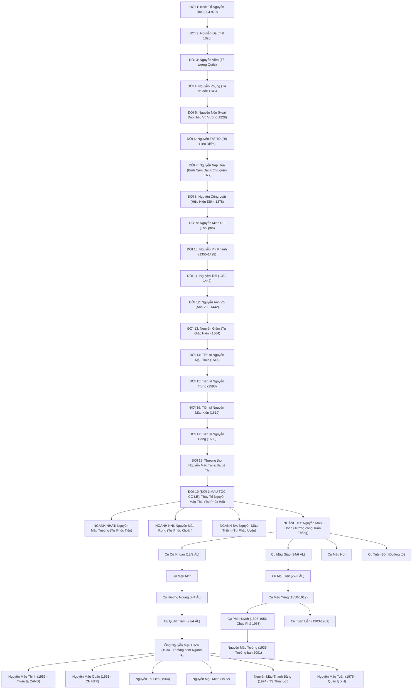

# NGỌC PHẢ NGUYỄN MẬU TỘC
**Làng Thượng Lãng (Thôn Thượng Đền), Thị trấn Cổ Lễ, Huyện Trực Ninh, Tỉnh Nam Định**  
*Nguyên bản do Ban Biên Soạn Phả Tộc Họ Nguyễn Mậu biên soạn năm 2001 (Tân Tỵ)*  
*Kế thừa từ Chúc Phả năm Quý Tỵ (1953) của Cố Nguyễn Mậu Huỳnh (Phó Huỳnh)*

---

# LỜI NÓI ĐẦU & CỘI NGUỒN DÒNG HỌ

> *"Ẩm thuỷ ư nguyên*  
> *Hữu mộc ư căn*  
> *Thiên Kim dị đắc*  
> *Tộc phả Nan Tầm"*
> 
> *Tạm dịch:*  
> *Uống nước phải nhớ đến nguồn*  
> *Làm cây có rễ, lá cành tươi xanh*  
> *Ngàn vàng dễ kiếm dễ thành*  
> *Còn như tộc phả trời xanh khó tìm.*

Vùng đất **Cổ Lễ** (xưa là làng Mặt Lãng Thượng / Thượng Lãng, tổng Thần Lộ, huyện Trực Ninh, phủ Thiên Trường, trấn Sơn Nam Hạ) là nơi địa linh nhân kiệt, gắn liền với di tích lịch sử - văn hóa quốc gia đặc biệt **Chùa Cổ Lễ (Thần Quang Tự)** do Đức Thánh Tổ Nguyễn Minh Không sáng lập từ thời Lý.

Dòng họ **Nguyễn Mậu** tại Thôn Thượng Đền là một trong những cự tộc danh gia định cư lâu đời, có công cùng nhân dân địa phương khai hoang mở đất, lập làng dựng ấp, đắp đê ngăn lũ, giữ gìn phong tục và mở mang nghiệp học.

---

# BAN BIÊN SOẠN PHẢ TỘC NĂM 2001 (TÂN TỴ)
1. **Ông Nguyễn Mậu Tường** – Trưởng ban (Chi Phó Huỳnh)
2. **Ông Nguyễn Mậu Nhiên** – Phó ban
3. **Ông Nguyễn Mậu Thức** – Thư ký
4. **Các Ủy viên**:
   - Nguyễn Mậu Nhận, Nguyễn Mậu Cẩm, Nguyễn Mậu Sắc, Nguyễn Mậu Ngôn, Nguyễn Mậu Thiềng, Nguyễn Mậu Viễn, Nguyễn Mậu Hách, Nguyễn Mậu Lộc, Nguyễn Mậu Quảng, Nguyễn Mậu Chính, Nguyễn Mậu Lê Khanh, Nguyễn Mậu Ngoãn.

---

# TỔNG QUAN 28 THẾ HỆ PHẢ HỆ (TỪ NĂM 904 ĐẾN 2000)

---

# THẾ THỨ PHẢ HỆ CHI TIẾT

## I. PHẦN THƯỢNG PHẢ (ĐỜI 1 – ĐỜI 18)

- **Đời 1**: **Nguyễn Bặc** (904 – 979). Khởi Tổ Nguyên Đương họ Nguyễn. Quê Đại Hữu, Gia Viễn, Ninh Bình. Bạn cờ lau tam đồng với Đinh Bộ Lĩnh. Đại tướng số 1 giúp dẹp 12 sứ quân, lập nhà Đinh. Thừa tướng Định Quốc Công.
- **Đời 2**: **Nguyễn Đệ** (mất 1028). Con trưởng Tổ Bặc. Điện Tiền đô chỉ huy sứ triều Tiền Lê. Đô hiệu Điểm Tước hầu triều Lý Thái Tổ.
- **Đời 3**: **Nguyễn Viễn**. Con thứ 2 Tổ Nguyễn Đệ. Tả tướng Quốc - Tham tri sự triều Lý Nhân Tông (1072-1127).
- **Đời 4**: **Nguyễn Phụng**. Võ cử nhân, Tả đô đốc triều Lý Anh Tông (1145).
- **Đời 5**: **Nguyễn Nộn** (mất 1229). Đại Thắng Vương, Hoài Đạo Hiếu Vũ Vương. 72 đền thờ dọc sông Đuống đến Lục Đầu Giang.
- **Đời 6**: **Nguyễn Thế Tứ**. Đô Hiệu Điểm qua 3 triều vua Trần (Thái Tông, Thánh Tông, Nhân Tông).
- **Đời 7**: **Nguyễn Nạp Hoà** (mất 1377). Bình Nam Đại tướng quân triều Trần Duệ Tông.
- **Đời 8**: **Nguyễn Công Luật**. Hữu Hiệu Điểm triều Trần (1378). Cai quản quân phủ Thiên Trường.
- **Đời 9**: **Nguyễn Minh Du**. Chỉ huy quân Thiết Hổ, Thái phó thời Trần.
- **Đời 10**: **Nguyễn Phi Khanh** (1355 – 1428). Thái học sinh thời Trần - Hồ, thân phụ Nguyễn Trãi.
- **Đời 11**: **Nguyễn Trãi** (1380 – 1442). Danh nhân văn hóa thế giới UNESCO. Khai quốc công thần triều Hậu Lê, Nhập nội Hành khiển, Tuyên phụng Đại phu, Huệ Quốc Công. Vợ kế: Phạm Thị Mẫn.
- **Đời 12**: **Nguyễn Anh Võ (Anh Vũ)** (sinh 1442). Con thứ 6 cụ Nguyễn Trãi và bà Phạm Thị Mẫn. Vua Lê Thánh Tông minh oan (1464), phong Tri châu, cấp 100 mẫu ruộng lộc điền.
- **Đời 13**: **Nguyễn Giám** (Tự Giác Hiền). Đỗ Khảo trường Quốc Tử Giám triều Lê Hiến Tông (1504).
- **Đời 14**: **Nguyễn Mậu Trực** (Tự Phúc Văn). Tiến sĩ khảo triều Mạc (1546).
- **Đời 15**: **Nguyễn Trung** (Tự Phúc Hiếu). Tiến sĩ năm Quý Tỵ (1593) triều Lê.
- **Đời 16**: **Nguyễn Mậu Kiên** (Tự Phúc Hoà). Tiến sĩ năm Bính Thìn (1619) triều Lê Thần Tông.
- **Đời 17**: **Nguyễn Đăng** (Tự Phúc Khải). Tiến sĩ năm Bính Tý (1639) triều Lê Kính Tông.
- **Đời 18**: **Nguyễn Mậu Tài** (Tự Mậu Tú, hiệu Phúc Thành / Viết Trai tiên sinh). Phó Đô ngự sử, Chánh sứ sang nhà Thanh (1673), Thượng thư Bộ Hình (1675), Thượng thư Bộ Binh (1676). Vợ thứ: Lê Thị Tiểu Thư.

---

## II. PHẦN TRUNG PHẢ (CỘI NGUỒN CỔ LỄ - ĐỜI 19 ĐẾN ĐỜI 28)

### ĐỜI 19 (ĐỜI 1 MẬU TỘC CỔ LỄ - THỦY TỔ)
- **Cụ Thủy Tổ: Nguyễn Mậu Thái (Tự Phúc Hội)**
  - Con thứ 6 Thượng thư Nguyễn Mậu Tài. Về Thượng Lãng (Cổ Lễ) lập nghiệp năm Nhâm Tuất (1682). Được triều Lê phong **Hậu Thần**.
  - Kỵ nhật (ngày giỗ): **mồng 5 tháng 6 Âm lịch**.
  - Chính thất: Cụ Bà **Nguyễn Thị Ái** (giỗ 16/02 Âm lịch).
  - Sinh 4 người con trai (khởi lập 4 Ngành Họ Nguyễn Mậu):
    1. **Ngành Nhất**: Nguyễn Mậu Trường (Tự Phúc Tiên) – Giỗ 01/10 Âm lịch.
    2. **Ngành Nhị**: Nguyễn Mậu Rong (Tự Phúc Khoán) – Giỗ 14/03 Âm lịch.
    3. **Ngành Ba**: Nguyễn Mậu Thiêm (Tự Pháp Uyên) – Giỗ 30/09 Âm lịch.
    4. **Ngành Tư**: Nguyễn Mậu Hoàn (Tướng công Tuấn Thông / Viết Nghĩa) – Giỗ 12 tháng Giêng Âm lịch.

---

### ĐỜI 20 (ĐỜI 2 MẬU TỘC - 4 NGÀNH)
1. **Ngành Nhất**: Cụ **Nguyễn Mậu Trường (Phúc Tiên)** & Cụ Bà Nguyễn Thị Trường (giỗ 01/10 ÂL).
2. **Ngành Nhị**: Cụ **Nguyễn Mậu Rong (Phúc Khoán)** & Cụ Bà Nguyễn Thị Rong (giỗ 30/12 ÂL).
3. **Ngành Ba**: Cụ **Nguyễn Mậu Thiêm (Pháp Uyên)** & Cụ Bà Nguyễn Thị Viên (giỗ 15/07 ÂL).
4. **Ngành Tư**: Cụ **Nguyễn Mậu Hoàn (Tướng công Tuấn Thông / Viết Nghĩa)** (1728 – 1780, thọ 53 tuổi, giỗ 12/01 ÂL). Tri huyện Mỹ Lộc, Tá lang, Tri phủ Thiên Trường dũng phủ quân. Vua phong Tướng công, ban 100 mẫu ruộng cúng tế. Cụ Bà giỗ 14/03 ÂL.

---

### ĐỜI 21 ĐẾN ĐỜI 25 (CÁC NHÁNH NGÀNH 4)
- **Nhánh Cụ Cử Khoan** (giỗ 15/8 ÂL) $\rightarrow$ Cụ Mậu Mền $\rightarrow$ Cụ Hương Ngung (**Nguyễn Mậu Ngung**, giỗ 4/4 ÂL, vợ Nguyễn Thị Kiêm giỗ 20/6) $\rightarrow$ Cụ Quản Trắm (**Nguyễn Mậu Trắm**, giỗ 27/4 ÂL, vợ Nguyễn Thị Thân giỗ 11/8) $\rightarrow$ Ông **Nguyễn Mậu Hách** (Sinh 1934, Giáp Tuất, Trưởng nam Ngành 4 Nguyễn Mậu Tộc, Chủ tịch UBMTTQ TT. Cổ Lễ; vợ Nguyễn Thị Áp sinh 1933).
- **Nhánh Cụ Mậu Giáo** (giỗ 24/6 ÂL) $\rightarrow$ Cụ Mậu Tạc (giỗ 27/3 ÂL, vợ Nguyễn Thị Bòng giỗ 23/3) $\rightarrow$ Cụ Mậu Yêng (1850 – 1912, giỗ 17/4 ÂL; vợ cả Nguyễn Thị Thận 1851-1930 giỗ 2/7, vợ thứ Hoàng Thị Gái giỗ 23/7) $\rightarrow$ Cụ Phó Huỳnh (**Nguyễn Mậu Huỳnh** 1896 – 1956, giỗ 8/1 ÂL, người biên soạn Chúc phả 1953; vợ Nguyễn Thị Hạt 1903-1971 giỗ 1/5) $\rightarrow$ Cụ **Nguyễn Mậu Điển** (1929 – 1998, giỗ 17/3), Cụ **Nguyễn Mậu Tường** (Sinh 1935, Trưởng ban biên soạn Phả tộc năm 2001).
- **Nhánh Cụ Lý Nhạc** (**Nguyễn Mậu Nhạc**, giỗ 5/8 ÂL) $\rightarrow$ Cụ Tuần Riệp (**Nguyễn Mậu Thích** 1916 – 1964, giỗ 29/1 ÂL; vợ Đàm Thị Cách - Mẹ VNAH, có con trai là Liệt sĩ **Nguyễn Mậu Đức** hy sinh năm 1969).
- **Nhánh Cụ Quản Hinh** (**Nguyễn Mậu Hinh**) $\rightarrow$ Các cụ: Phúc (1902-1989), Khánh (1904-1950), Khương (1908), Hưởng (1918-1993), Ruân (1920-2000), Kình (1910-1966).
- **Nhánh Cụ Cửu Linh** (**Nguyễn Mậu Cẩm** 1901 – 1975, giỗ 17/8 ÂL) $\rightarrow$ Cụ **Nguyễn Mậu Lê Khanh** (Sinh 1927, cán bộ TW Đoàn, vợ Đoàn Thị Kim Liên).

---

### ĐỜI 26, 27, 28 (THẾ HỆ ĐƯƠNG ĐẠI & HẬU DUỆ MĂNG NON)
- **Gia đình Trưởng nam Ngành 4 – Cụ Nguyễn Mậu Hách & Cụ Bà Nguyễn Thị Áp**:
  1. **Nguyễn Mậu Thịnh** (Sinh 1956, Bính Thân) – Tốt nghiệp ĐH An ninh, Thiếu tá Công an, Phó phòng Chính trị Công an tỉnh Đồng Nai. Vợ: Đoàn Thị Kim Loan (1959). Con: Nguyễn Thị Thùy Dương (1981).
  2. **Nguyễn Mậu Quân** (Sinh 1961, Tân Sửu) – Chủ nhiệm HTX May mặc Nghĩa Lợi. Vợ: Nguyễn Thị Hạnh (1962). Con: Nguyễn Thị Thúy Vân (1984), Nguyễn Mậu Trung Anh (1987).
  3. **Nguyễn Thị Liên** (Sinh 1964, Giáp Thìn) – Chồng: Đặng Minh Khang (Liên Tỉnh, Nam Trực).
  4. **Nguyễn Mậu Minh** (Sinh 1972, Nhâm Tý) – Vợ: Đinh Thị Ngoãn (1974). Con: Nguyễn Thị Thu Hiền (2000).
  5. **Nguyễn Mậu Thanh Bằng** (Sinh 1974, Giáp Dần) – Kỹ sư Thủy lợi, Tiến sĩ tại Nga, Viện Khoa học Thủy lợi Việt Nam.
  6. **Nguyễn Mậu Tuấn** (Sinh 1976, Bính Thìn) – Cử nhân Quản lý xã hội.

---

# BẢNG TRA CỨU KỴ NHẬT (NGÀY GIỖ ÂM LỊCH) TRONG NĂM

| Ngày Giỗ Âm Lịch | Họ và Tên Tiền Nhân | Thế hệ / Vai vế dòng tộc | Ghi chú & Nơi an táng |
|:---:|:---|:---|:---|
| **08 tháng Giêng** | **Nguyễn Mậu Huỳnh** (Phó Huỳnh) | Đời 24 (Đời 6 Mậu Tộc) | Tác giả Chúc phả 1953, sinh 1896 mất 1956 |
| **12 tháng Giêng** | **Nguyễn Mậu Hoàn** (Tuấn Thông) | **Đời 20 (Đời 2 Mậu Tộc)** | **TỔ KHỞI LẬP NGÀNH 4 - TƯỚNG CÔNG** |
| **29 tháng Giêng** | **Nguyễn Mậu Thích** (Tuần Riệp) | Đời 24 (Đời 6 Mậu Tộc) | Sinh 1916 mất 1964 thọ 49 tuổi |
| **16 tháng Hai** | **Nguyễn Thị Ái** | **Đời 19 (Đời 1 Mậu Tộc)** | **Chính thất Thủy Tổ Phúc Hội** |
| **26 tháng Hai** | **Nguyễn Mậu Giang** (Đội Giang) | Đời 22 (Đời 4 Mậu Tộc) | Chánh suất đội triều Nguyễn |
| **27 tháng Hai** | **Nguyễn Thị Cúc Hoa & Ngọc Hoa** | Đời 21 (Đời 3 Mậu Tộc) | Hai bà cô con gái Tổ Tuấn Hoàn |
| **14 tháng Ba** | **Nguyễn Mậu Rong** (Phúc Khoán) | **Đời 20 (Đời 2 Mậu Tộc)** | **TỔ KHỞI LẬP NGÀNH NHỊ** |
| **14 tháng Ba** | **Tổ Bà Ngành Tư** | **Đời 20 (Đời 2 Mậu Tộc)** | **Vợ Tướng công Tuấn Hoàn** |
| **23 tháng Ba** | **Nguyễn Thị Bòng** | Đời 22 (Đời 4 Mậu Tộc) | Vợ cụ Nguyễn Mậu Tạc |
| **27 tháng Ba** | **Nguyễn Mậu Tạc** | Đời 22 (Đời 4 Mậu Tộc) | Con thứ 3 cụ Mậu Giáo, thọ 49 tuổi |
| **17 tháng Ba** | **Nguyễn Mậu Điển** | Đời 25 (Đời 7 Mậu Tộc) | Huyện ủy viên Trực Ninh, thọ 70 tuổi |
| **04 tháng Tư** | **Nguyễn Mậu Ngung** (Hương Ngung) | Đời 23 (Đời 5 Mậu Tộc) | Giữ chức Hương hội |
| **17 tháng Tư** | **Nguyễn Mậu Yêng** | Đời 23 (Đời 5 Mậu Tộc) | Sinh 1850 mất 1912 thọ 53 tuổi |
| **21 tháng Tư** | **Nguyễn Mậu Hiện** (Tuần Liễn) | Đời 24 (Đời 6 Mậu Tộc) | Sinh 1903 mất 1981 thọ 79 tuổi |
| **27 tháng Tư** | **Nguyễn Mậu Trắm** (Quản Trắm) | Đời 24 (Đời 6 Mậu Tộc) | Thân phụ cụ Trưởng nam Mậu Hách |
| **01 tháng Năm** | **Nguyễn Thị Hạt** | Đời 24 (Đời 6 Mậu Tộc) | Vợ cụ Phó Huỳnh, mất 1971 thọ 69 tuổi |
| **09 tháng Năm** | **Nguyễn Mậu Tợi** | Đời 22 (Đời 4 Mậu Tộc) | Con thứ 3 cụ Mậu Hợi |
| **05 tháng Sáu** | **Nguyễn Mậu Thái** (Phúc Hội) | **ĐỜI 19 (ĐỜI 1 MẬU TỘC)** | **THỦY TỔ NGUYỄN MẬU TỘC TẠI CỔ LỄ** |
| **06 tháng Sáu** | **Nguyễn Mậu Thống** | Đời 23 (Đời 5 Mậu Tộc) | Con trai cả cụ Mậu Lĩnh |
| **20 tháng Sáu** | **Nguyễn Thị Kiêm** | Đời 23 (Đời 5 Mậu Tộc) | Vợ cụ Hương Ngung |
| **24 tháng Sáu** | **Nguyễn Mậu Giáo** | Đời 21 (Đời 3 Mậu Tộc) | Con thứ 2 Tổ Tuấn Hoàn |
| **27 tháng Sáu** | **Nguyễn Mậu Lễ** | Đời 23 (Đời 5 Mậu Tộc) | Con thứ 2 cụ Mậu Việm |
| **02 tháng Bảy** | **Nguyễn Thị Thận** | Đời 23 (Đời 5 Mậu Tộc) | Chính thất cụ Mậu Yêng, thọ 80 tuổi |
| **15 tháng Bảy** | **Nguyễn Thị Viên** | **Đời 20 (Đời 2 Mậu Tộc)** | **Tổ bà Ngành Ba** |
| **23 tháng Bảy** | **Hoàng Thị Gái** (Cụ Trẻ) | Đời 23 (Đời 5 Mậu Tộc) | Thứ thất cụ Mậu Yêng, làng Vị Hoàng |
| **05 tháng Tám** | **Nguyễn Mậu Nhạc** (Lý Nhạc) | Đời 24 (Đời 6 Mậu Tộc) | Cụ Lý trưởng |
| **11 tháng Tám** | **Nguyễn Thị Thân** | Đời 24 (Đời 6 Mậu Tộc) | Thân mẫu cụ Trưởng nam Mậu Hách |
| **15 tháng Tám** | **Nguyễn Mậu Khoan** (Cử Khoan) | Đời 21 (Đời 3 Mậu Tộc) | Con trưởng Tổ Tuấn Hoàn, đồng giỗ vợ |
| **30 tháng Chín** | **Nguyễn Mậu Thiêm** (Pháp Uyên) | **Đời 20 (Đời 2 Mậu Tộc)** | **TỔ KHỞI LẬP NGÀNH BA** |
| **01 tháng Mười** | **Nguyễn Mậu Trường** (Phúc Tiên) | **ĐỜI 20 (ĐỜI 2 MẬU TỘC)** | **TỔ KHỞI LẬP NGÀNH NHẤT** |
| **01 tháng Mười** | **Nguyễn Thị Trường** | **Đời 20 (Đời 2 Mậu Tộc)** | **Tổ bà Ngành Nhất** |
| **14 tháng Mười Một** | **Nguyễn Mậu Lĩnh & Nguyễn Thị Là** | Đời 22 (Đời 4 Mậu Tộc) | Đồng giỗ hai cụ ngày 14/11 Âm lịch |
| **30 tháng Chạp** | **Nguyễn Thị Rong** | **Đời 20 (Đời 2 Mậu Tộc)** | **Tổ bà Ngành Nhị** |
